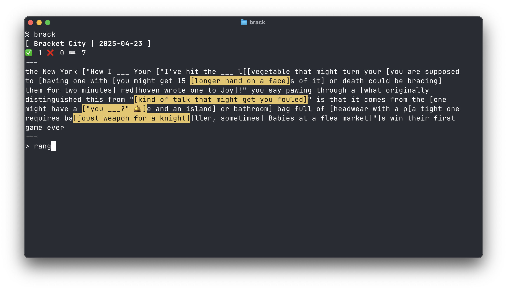

# brack



Play [Bracket City](https://www.theatlantic.com/games/bracket-city) on the command line.

You can install brack with:

```
$ go install github.com/a-poor/brack
```

Here's the help output:

```
$ brack --help
NAME:
   bracket-city - Play Bracket City on the command line.

USAGE:
   bracket-city [global options] [ DATE ]

VERSION:
   0.0.1

DESCRIPTION:
   Play Bracket City, by the Atlantic.

   Bracket City is a daily puzzle game published by The Atlantic.

   DATE is an optional argument that specifies the date of the puzzle to play.
   If no date is provided, the current date will be used.

   Example:

   $ bracket-city 2024-01-01

   Bracket City: https://theatlantic.com/games/bracket-city


GLOBAL OPTIONS:
   --help, -h     show help
   --version, -v  print the version
```
